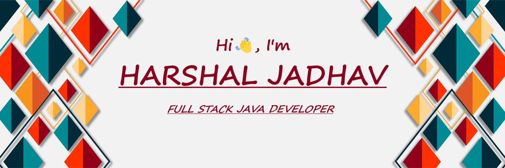

<!-- Github Banner Section-->

<!-- Adding Social Buttons -->

  
  
  
  

<h1></h1>

Hey there,

I'm Harshal, a Full-Stack Web Developer based in Pune Maharashtra, Who is passionate about building user-friendly, easy-to-use applications, I like to explore new trends and learn new technologies. I'm Currently learning Java, SpringBoot, MySQL and looking to collaborate on Open-Source projects, with a goal to be more involved in the Community.

Want to know more about me? [Check out my portfolio](https://harshal-jadhav.github.io/)

## 🛠 My Toolkit : 

 

